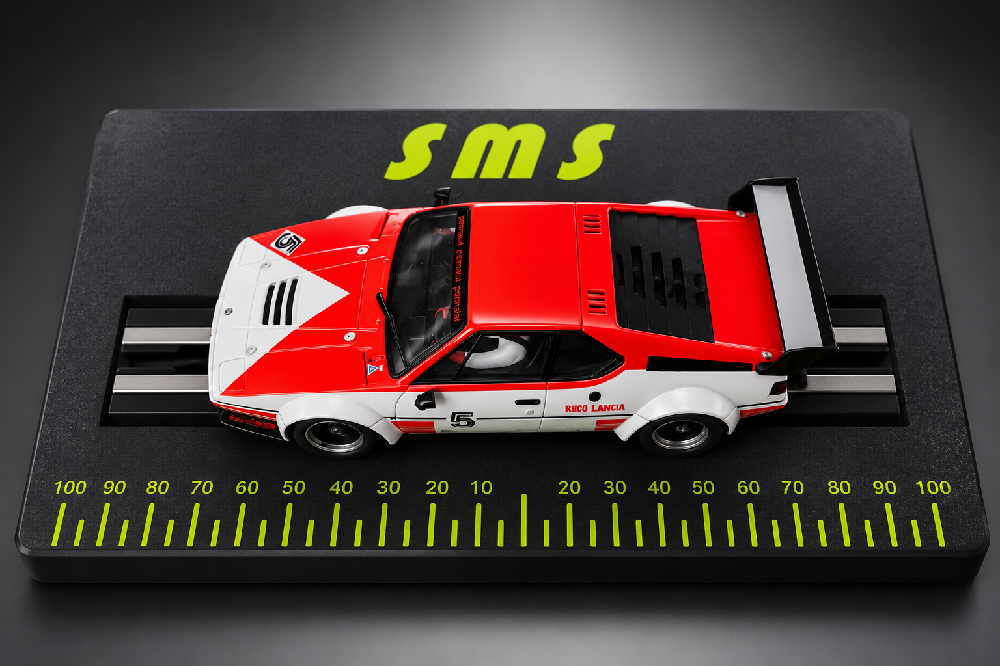

# Slotcar Magnet Scale — ESP8266 Firmware

[🇬🇧 English Version](#english-version)  |  [🇩🇪 Deutsche Version](#deutsche-version)

---

<a id="english-version"></a>

# 🇬🇧 English Version

> [🇩🇪 Zur deutschen Version](#deutsche-version)


This project reads two load cells mounted on opposite ends of a shared long platform.
The load distribution between left/right changes depending on the position of the force, but the total weight is calculated from a weighted combination of both sensors.

Total weight formula:

```
weightGrams = factorLeft * netLeft + factorRight * netRight
```

Where:

- `netLeft  = rawLeft  - offsetLeft`
- `netRight = rawRight - offsetRight`

The factors are not calibrated individually per cell, but jointly across multiple positions using the same reference weight.

## Wiring

### Left HX711

| HX711 Pin | Wemos D1 Mini |
|-----------|--------------|
| DOUT / DT | D1 / GPIO5   |
| SCK / CLK | D2 / GPIO4   |
| VCC       | 3V3          |
| GND       | GND          |

### Right HX711

| HX711 Pin | Wemos D1 Mini |
|-----------|--------------|
| DOUT / DT | D5 / GPIO14  |
| SCK / CLK | D6 / GPIO12  |
| VCC       | 3V3          |
| GND       | GND          |

## Mechanical Setup



Both load cells are rigidly connected to the same platform. This makes true individual per-cell calibration mechanically impossible.
When force is applied on the left, the left share increases and the right share decreases (and vice versa).
Only the joint multi-point calibration can correctly convert this load distribution into stable gram values.

## Why Multiple Positions Are Required

If the reference weight is measured at only one position, there are infinitely many factor pairs that fit that single measurement.
Only through several clearly different positions (e.g. far left, center, far right) does the system of equations become sufficiently determined.
The firmware solves the factors using Least Squares from all recorded points.

## PlatformIO

1. Open project in VS Code with PlatformIO.
2. Connect Wemos D1 mini via USB.
3. Upload firmware.
4. Start serial monitor at 115200 baud.
5. Line endings CR, LF or CRLF (all are supported).

## Step-by-Step Calibration

1. Completely unload the platform.
2. Set tare:

```
TARA 20
```

3. Start calibration mode with a known reference weight, e.g. 1000 g:

```
KAL_START 1000
```

4. Place the same weight at multiple positions and record each point:

```
KAL_PUNKT LINKS 20
KAL_PUNKT MITTE 20
KAL_PUNKT RECHTS 20
```

5. Optionally review the recorded points:

```
KAL_LISTE
```

6. Calculate and activate the factors:

```
KAL_BERECHNEN
```

After a successful `KAL_BERECHNEN` the factors are automatically saved to EEPROM.

## Example Calibration with 1000 g

```
TARA 20
KAL_START 1000
KAL_PUNKT LINKS 20
KAL_PUNKT MITTE 20
KAL_PUNKT RECHTS 20
KAL_BERECHNEN
```

Then verify:

```
MESSEN 10
```

## Command Reference

| Command | Description |
|---------|-------------|
| `HILFE` | Show help |
| `STATUS` | Show current status |
| `WLAN <ssid> <password>` | Save Wi-Fi credentials |
| `WLAN_LOESCHEN` | Clear Wi-Fi credentials |
| `TARA [n]` | Set tare (optional: n samples) |
| `KAL_START <weight_g>` | Start calibration session |
| `KAL_PUNKT <name> [n]` | Record calibration point |
| `KAL_LISTE` | List recorded calibration points |
| `KAL_LOESCHEN` | Delete all calibration points |
| `KAL_BERECHNEN` | Calculate and save factors |
| `KAL_ABBRUCH` | Abort calibration session |
| `MESSEN [n]` | Single measurement |
| `ROH [n]` | Raw ADC values |
| `START [interval_ms] [n]` | Start streaming |
| `STOP` | Stop streaming |
| `INTERVALL <ms>` | Set stream interval |
| `FAKTOREN <left> <right>` | Set factors manually |
| `SPEICHERN` | Save to EEPROM |
| `RESET` | Reboot device |

## Wi-Fi Behaviour

- On startup, if configured, a STA connection to the stored Wi-Fi is attempted.
- If the connection fails, the fallback AP starts automatically:
  - SSID: `Slotcar-Magnet-Scale`
  - Password: `slotcar123`
- `STATUS` shows the current Wi-Fi mode (STA, AP, or AP+STA) and whether a STA connection is active.

## Web Interface


- The firmware provides a local web interface.
- Access in the browser:
  - On the home network via the STA IP (see `STATUS`)
  - Or on the fallback AP via `http://192.168.4.1`
- The web app has a collapsible menu with sections:
  - Dashboard • Measurement • Calibration • Wi-Fi • System
- The legacy route `/kalibrierung` redirects directly to the calibration section.
- Wi-Fi page: network scan, select SSID from list, save/clear Wi-Fi, connection details.
- Calibration section shows the recorded point list live as a table with target / calculated / deviation.

## OTA Firmware Update

The **System** tab of the web interface provides over-the-air updates:

1. The device must be connected to Wi-Fi (STA mode).
2. Click **Nach Updates suchen** — the browser queries the [GitHub Releases](https://github.com/Peschi90/Slotcar-Magnet-Scale/releases) for the latest `firmware.bin`.
3. If a newer version is available, click **Jetzt flashen** — the device downloads, flashes, and reboots automatically.

## Output Formats

`MESSEN` returns at minimum:

- `LINKS_ROH` / `RECHTS_ROH`
- `LINKS_NETTO` / `RECHTS_NETTO`
- `LINKS_ANTEIL` / `RECHTS_ANTEIL` (when calculable)
- `GEWICHT`

Stream mode (`START 500 5`) outputs compact:

```
GEWICHT: 1000.42 g | LINKS: 61.8 % | RECHTS: 38.2 %
```

## EEPROM Contents

- Offset left / right
- Factor left / right
- Tare present flag
- Valid calibration flag
- Config version, Magic number, Checksum

Temporary calibration points are not stored.

## Notes on Mechanical Stress

- The platform must not tilt or jam sideways.
- Mount both sides as symmetrically as possible.
- Cables must not pull on the platform mechanically.
- Heavy mechanical stress significantly increases calibration errors.
- If `KAL_BERECHNEN` reports large residuals, check mechanics first, then repeat calibration.

---

<a id="deutsche-version"></a>

# 🇩🇪 Deutsche Version

> [🇬🇧 To the English version](#english-version)


Dieses Projekt liest zwei Wägezellen aus, die an den gegenüberliegenden Enden einer gemeinsamen langen Platte montiert sind.
Die Lastverteilung zwischen links/rechts ändert sich je nach Position der Kraft, das Gesamtgewicht wird aber aus einer gewichteten Kombination beider Sensoren berechnet.

Formel der Gesamtmessung:

```
gewichtGramm = faktorLeft * netLeft + faktorRight * netRight
```

Dabei gilt:

- `netLeft  = rawLeft  - offsetLeft`
- `netRight = rawRight - offsetRight`

Die Faktoren werden nicht einzeln pro Zelle kalibriert, sondern gemeinsam über mehrere Positionen mit demselben Referenzgewicht.

## Verdrahtung

### Linker HX711

| HX711 Pin | Wemos D1 Mini |
|-----------|--------------|
| DOUT / DT | D1 / GPIO5   |
| SCK / CLK | D2 / GPIO4   |
| VCC       | 3V3          |
| GND       | GND          |

### Rechter HX711

| HX711 Pin | Wemos D1 Mini |
|-----------|--------------|
| DOUT / DT | D5 / GPIO14  |
| SCK / CLK | D6 / GPIO12  |
| VCC       | 3V3          |
| GND       | GND          |

## Mechanischer Aufbau


Beide Wägezellen sind fest mit derselben Platte verbunden. Dadurch ist eine echte Einzelkalibrierung pro Zelle mechanisch nicht möglich.
Wenn die Kraft links angreift, steigt der linke Anteil und der rechte Anteil sinkt (und umgekehrt).
Nur die gemeinsame Mehrpunktkalibrierung kann diese Lastverteilung korrekt in stabile Grammwerte umrechnen.

## Warum mehrere Positionen zwingend sind

Wenn das Referenzgewicht nur an einer Position gemessen wird, gibt es unendlich viele Faktorpaare, die dort passen.
Erst durch mehrere deutlich unterschiedliche Positionen (z. B. weit links, Mitte, weit rechts) wird das Gleichungssystem ausreichend bestimmt.
Die Firmware löst die Faktoren mit Least Squares aus allen aufgenommenen Punkten.

## PlatformIO

1. Projekt in VS Code mit PlatformIO öffnen.
2. Wemos D1 mini per USB verbinden.
3. Firmware hochladen (Upload).
4. Seriellen Monitor mit 115200 Baud starten.
5. Zeilenende CR, LF oder CRLF verwenden (alles wird unterstützt).

## Schritt-für-Schritt-Kalibrierung

1. Platte komplett entlasten.
2. Tara setzen:

```
TARA 20
```

3. Kalibriermodus mit bekanntem Referenzgewicht starten, Beispiel 1000 g:

```
KAL_START 1000
```

4. Dasselbe Gewicht nacheinander an mehreren Positionen platzieren und jeweils Punkt aufnehmen:

```
KAL_PUNKT LINKS 20
KAL_PUNKT MITTE 20
KAL_PUNKT RECHTS 20
```

5. Punkte optional prüfen:

```
KAL_LISTE
```

6. Faktoren berechnen und aktivieren:

```
KAL_BERECHNEN
```

Nach erfolgreichem `KAL_BERECHNEN` werden die Faktoren automatisch im EEPROM gespeichert.

## Beispielkalibrierung mit 1000 g

```
TARA 20
KAL_START 1000
KAL_PUNKT LINKS 20
KAL_PUNKT MITTE 20
KAL_PUNKT RECHTS 20
KAL_BERECHNEN
```

Anschließend prüfen:

```
MESSEN 10
```

## Befehlsübersicht

| Befehl | Beschreibung |
|--------|-------------|
| `HILFE` | Hilfe anzeigen |
| `STATUS` | Aktuellen Status anzeigen |
| `WLAN <ssid> <passwort>` | WLAN-Zugangsdaten speichern |
| `WLAN_LOESCHEN` | WLAN-Zugangsdaten löschen |
| `TARA [n]` | Tara setzen (optional: n Messungen) |
| `KAL_START <gewicht_g>` | Kalibriersitzung starten |
| `KAL_PUNKT <name> [n]` | Kalibrierpunkt aufnehmen |
| `KAL_LISTE` | Aufgenommene Punkte auflisten |
| `KAL_LOESCHEN` | Alle Kalibrierpunkte löschen |
| `KAL_BERECHNEN` | Faktoren berechnen und speichern |
| `KAL_ABBRUCH` | Kalibriersitzung abbrechen |
| `MESSEN [n]` | Einzelmessung |
| `ROH [n]` | Rohe ADC-Werte |
| `START [intervall_ms] [n]` | Stream starten |
| `STOP` | Stream stoppen |
| `INTERVALL <ms>` | Stream-Intervall setzen |
| `FAKTOREN <links> <rechts>` | Faktoren manuell setzen |
| `SPEICHERN` | Im EEPROM speichern |
| `RESET` | Gerät neu starten |

## WLAN-Verhalten

- Beim Start wird, falls konfiguriert, eine STA-Verbindung zum gespeicherten WLAN versucht.
- Falls keine Verbindung zustande kommt, startet automatisch der Backup-AP:
  - SSID: `Slotcar-Magnet-Scale`
  - Passwort: `slotcar123`
- `STATUS` zeigt den aktuellen WLAN-Modus (STA, AP oder AP+STA) und ob eine STA-Verbindung aktiv ist.

## Weboberfläche


- Die Firmware stellt eine lokale Weboberfläche bereit.
- Aufruf im Browser:
  - Im Heimnetz über die STA-IP (siehe `STATUS`)
  - Oder im Backup-AP über `http://192.168.4.1`
- Die Web-App hat eine ausklappbare Menüleiste mit Seitenbereichen:
  - Dashboard • Messung • Kalibrierung • WLAN • System
- Die alte Route `/kalibrierung` leitet direkt auf den Kalibrierungsbereich weiter.
- WLAN-Seite: Netzwerkscan, SSID aus Liste übernehmen, WLAN speichern/löschen, Verbindungsdetails.
- Kalibrierungsbereich zeigt die Punktliste live als Tabelle mit Soll / Berechnet / Abweichung.

## OTA Firmware-Update

Der **System**-Tab der Weboberfläche ermöglicht Over-the-Air-Updates:

1. Das Gerät muss per WLAN verbunden sein (STA-Modus).
2. Klick auf **Nach Updates suchen** — der Browser prüft die [GitHub Releases](https://github.com/Peschi90/Slotcar-Magnet-Scale/releases) auf die neueste `firmware.bin`.
3. Bei verfügbarer neuer Version Klick auf **Jetzt flashen** — das Gerät lädt die Firmware herunter, flasht sie und startet automatisch neu.

## Ausgabeformate

`MESSEN` liefert mindestens:

- `LINKS_ROH` / `RECHTS_ROH`
- `LINKS_NETTO` / `RECHTS_NETTO`
- `LINKS_ANTEIL` / `RECHTS_ANTEIL` (wenn sinnvoll berechenbar)
- `GEWICHT`

Streammodus (`START 500 5`) liefert kompakt:

```
GEWICHT: 1000.42 g | LINKS: 61.8 % | RECHTS: 38.2 %
```

## EEPROM-Inhalt

Gespeichert werden:

- Offset links / rechts
- Faktor links / rechts
- Tara vorhanden
- Gültige Kalibrierung vorhanden
- Konfigurationsversion, Magic Number, Prüfsumme

Temporäre Kalibrierpunkte werden nicht gespeichert.

## Hinweise zur mechanischen Verspannung

- Die Platte sollte nicht verkanten oder seitlich klemmen.
- Befestigungen links/rechts möglichst gleichartig ausführen.
- Kabel dürfen die Platte nicht mechanisch mitziehen.
- Bei starker Verspannung steigen die Kalibrierfehler deutlich.
- Wenn `KAL_BERECHNEN` große Restfehler meldet, zuerst Mechanik prüfen, dann Kalibrierung wiederholen.
